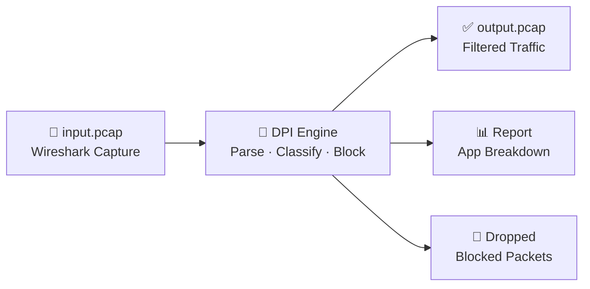
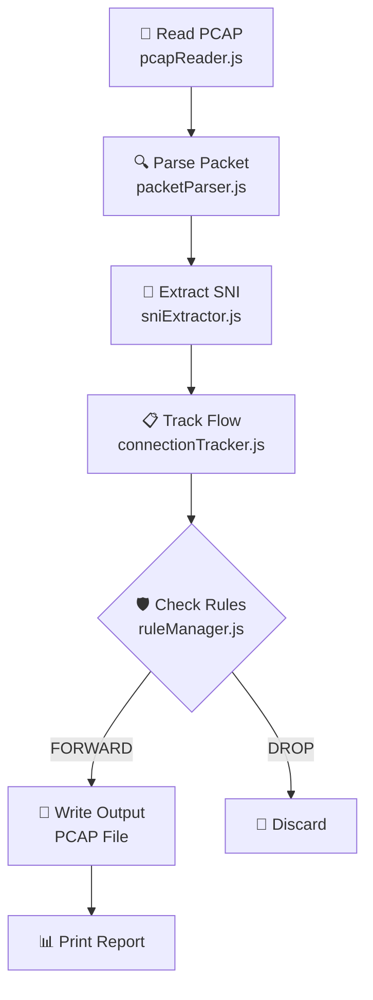
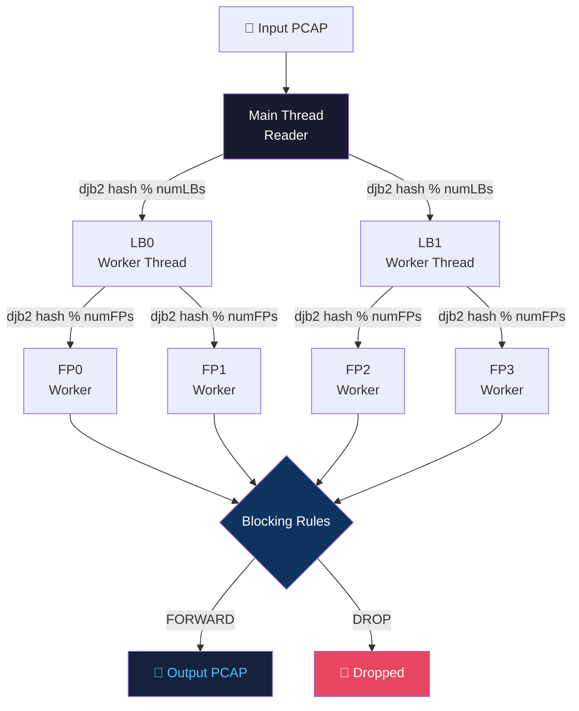

<div align="center">

<h1>🔬 Packet Analyzer — DPI Engine</h1>

<p><strong>Deep Packet Inspection System — Pure Node.js, Zero Dependencies</strong></p>


</div>

---

## 📑 Table of Contents
1. [🔬 What is DPI?](#-what-is-dpi)
2. [🏗️ Architecture](#️-architecture)
3. [📁 File Structure](#-file-structure)
4. [⚙️ Installation](#️-installation)
5. [🚀 Usage](#-usage)
6. [🧠 How It Works](#-how-it-works)
7. [📱 Supported Applications](#-supported-applications)
8. [🧵 Multi-Threading Deep Dive](#-multi-threading-deep-dive)
9. [🖥️ Sample Output](#️-sample-output)
10. [🚫 Blocking Examples](#-blocking-examples)
11. [⚡ Performance](#-performance)
12. [🤝 Contributing](#-contributing)
13. [📄 License](#-license)

---

## 🔬 What is DPI?
**Deep Packet Inspection (DPI)** examines the contents of network packets inside the payload. Rather than simply acting as a firewall checking IP headers, DPI navigates inside TLS encryption handshakes and application protocols.

**Real-world uses:**
- Network security and intrusion detection
- ISPs restricting P2P/BitTorrent traffic
- Corporate and parental content blocking logic



---

## 🏗️ Architecture

### Diagram 1 - Single-threaded Mode (`index.js`)


### Diagram 2 - Multi-threaded Mode (`indexMT.js`)


---

## 📁 File Structure

```text
Packet_analyzer/
├── src/
│   ├── connectionTracker.js  # Bidirectional flow map caching reverse 5-tuple lookups
│   ├── dpiEngine.js          # Core orchestrator hooking multi-threaded LBs and output buffer
│   ├── fastPath.js           # Worker class performing actual flow SNI payload extraction
│   ├── index.js              # Entrypoint: standalone sequential single-threaded execution
│   ├── indexMT.js            # Entrypoint: high-concurrency Node worker_threads execution
│   ├── loadBalancer.js       # LB thread dispatcher utilizing deterministic djb2 flow hashing
│   ├── mainDpi.js            # Alternate drop-in executable offering complete console diagrams
│   ├── mainSimple.js         # Basic console dump tracing tool ignoring packet dropping logic
│   ├── packetParser.js       # Slices Buffer offsets mathematically for Ethernet, IPv4, TCP
│   ├── pcapReader.js         # Validates Endianness & yields buffers natively by header len
│   ├── ruleManager.js        # Ordered Map array block mechanism checking ip/apps/domains
│   ├── sniExtractor.js       # Translates offsets to capture 0x00 Type TLS Client Hello SNI
│   ├── threadSafeQueue.js    # Unresolved ES6 Promises mimicking std::condition_variable
│   └── types.js              # Constant enums and substring mapping mapping SNI to AppType
├── generateTestPcap.js       # Synthesizes 77 randomized valid TLS/HTTP/DNS testing bytes
├── package.json              # Defines project CLI runnable scripts referencing src scripts
├── test_dpi.pcap             # Capture output generated locally by generateTestPcap.js
├── output.pcap               # Drop-filtered bytes securely written to disk via DPI run
└── README.md                 # This repository documentation file
```

---

## ⚙️ Installation

```bash
git clone https://github.com/mukundjha-mj/dpi.git
cd dpi
node --version  # must be >= 16.0.0
```

**NO npm install needed. Zero external dependencies!**

---

## 🚀 Usage

### 1. Generating Test Data
Generates fake Wireshark packets for local validation without capturing your live PC network.
```bash
node generateTestPcap.js
```
```text
Created test_dpi.pcap with test traffic
  - 16 TLS connections with SNI
  - 2 HTTP connections
  - 4 DNS queries
  - 5 packets from blocked IP 192.168.1.50
```

### 2. Run Diagnostic Dumper (`mainSimple.js`)
Lists raw TCP traces and domain resolutions without generating an output `.pcap` or evaluating blocks.
```bash
node src/mainSimple.js test_dpi.pcap
```
```text
Processing packets...
Packet 1: 192.168.1.100:60057 -> 142.250.185.206:443
Packet 2: 142.250.185.206:443 -> 192.168.1.100:60057
Packet 3: 192.168.1.100:60057 -> 142.250.185.206:443
Packet 4: 192.168.1.100:60057 -> 142.250.185.206:443 [SNI: www.google.com]
[... truncated 73 more packets ...]
Total packets: 77
SNI extracted: 16
```

### 3. Run Single-threaded Engine (`index.js`)
Executes synchronously natively in a single sequence blocking pipeline.
**Options:** `--block-ip`, `--block-app`, `--block-domain`
```bash
node src/index.js test_dpi.pcap out.pcap
```

### 4. Run Multi-threaded Engine (`indexMT.js`)
Executes utilizing pure high-performance Node `worker_threads` pooling algorithm.
**Options:** `--block-ip`, `--block-app`, `--block-domain`, `--lbs`, `--fps`
```bash
node src/indexMT.js test_dpi.pcap out.pcap --lbs 2 --fps 4
```

---

## 🧠 How It Works

<details>
<summary><b>📦 PCAP Reading</b></summary>
The PCAP starts with a 24-byte <b>Global Header</b>:
- `buf.readUInt32LE(0)` - Magic Identifier (`0xa1b2c3d4` native, `0xd4c3b2a1` swapped)
- `buf.readUInt16LE(4)` - Version Major
- `buf.readUInt16LE(6)` - Version Minor
- `buf.readUInt32LE(16)` - Snaplen bytes limit

Subsequent loop reads 16-byte <b>Packet Headers</b>:
- `buf.readUInt32LE(offset)` - Timestamp seconds
- `buf.readUInt32LE(offset + 8)` - `inclLen` (Bytes actually saved within block)
Once the byte slice length is identified, we emit a native zero-copy `Buffer.subarray()` pointing strictly to payload bounds.
</details>

<details>
<summary><b>🔍 Packet Parsing</b></summary>
Handled in `src/packetParser.js`:
- <b>Ethernet Header (14 Bytes):</b> Checks if `etherType === 0x0800` (IPv4).
- <b>IPv4 Header:</b> Extracts lengths dynamically. Evaluates boundaries `data[ipStart + 9]` for TCP/UDP signatures. Slices out raw 32-bit big-endian representation dynamically converting `readUInt32BE(12)` via mathematical string masking algorithm to dotted-decimal.
- <b>TCP/UDP:</b> Maps `tcpSeq`, `tcpAck`, flags, and evaluates offset math dynamically `(data[transportStart + 12] >> 4) & 0x0F` avoiding standard byte array sizes.
</details>

<details>
<summary><b>🔒 TLS SNI Extraction</b></summary>
Handled in `src/sniExtractor.js` avoiding heavy decryption layers:
- `payload[0] === 0x16` (Handshake content check)
- `payload[5] === 0x01` (Client Hello structural check)
- Offset to byte 43: Skip random numbers & bytes.
- Offset Length variables skipping dynamic elements: `offset += 1 + payload[offset]` (Session ID), bypass cipher suites, bypass compressions.
- Loop across Extensions chunk matching Type Code `0x0000` (Server Name). Pull `sniNameLen` via `payload.readUInt16BE(offset + 3)` transforming directly via string subset slicing.
</details>

<details>
<summary><b>🌊 Flow Tracking</b></summary>
Bidirectional packet maps (`src/connectionTracker.js`).
Every connection generates a rigid identifier format:
`192.168.1.100:60057-142.250.185.206:443-6` (Src:Port-Dst:Port-Prot)

We split this logic using `reverseKey()` generating `Dst:Port-Src:Port-Prot` enabling tracking logic to fetch connection profiles irrespective of originating client or responding server payload. Data states remain bound completely correctly throughout thread switching!
</details>

<details>
<summary><b>🛡️ Blocking Engine</b></summary>
Evaluated linearly via Hash Maps and native iteration logic bounds (`src/ruleManager.js`):
1. IP Lookup `blockedIPs.has(ip)`
2. App Lookup `blockedApps.has(appTypeStr)`
3. Domain Map `sni.includes(dom)`

The state enforces Flow Blocking, meaning returning packets corresponding to intercepted Client Hellos automatically evaluate directly returning `DROP` via bidirectional tracking lookup irrespective of missing TLS arrays directly shutting down internet responses.
</details>

---

## 📱 Supported Applications

The map is statically governed by substring matching algorithms residing directly in `types.js` based upon intercepted hostname patterns. 

| Emoji | App | SNI Pattern | Example |
|-------|-----|-------------|---------|
| 🔍 | Google | `google`, `gstatic`, `ggpht` | www.google.com |
| 📺 | YouTube | `youtube`, `ytimg`, `youtu.be` | www.youtube.com |
| 📘 | Facebook | `facebook`, `fbcdn`, `fb.com` | m.facebook.com |
| 📸 | Instagram | `instagram`, `cdninstagram` | api.instagram.com |
| 💬 | WhatsApp | `whatsapp`, `wa.me` | cdn.whatsapp.net |
| 🍿 | Netflix | `netflix`, `nflxvideo` | nflxvideo.net |
| 🖥️ | Microsoft | `microsoft`, `azure`, `live.com` | login.microsoftonline.com |
| 🐦 | Twitter | `twitter`, `twimg`, `x.com` | api.twitter.com |
| 📦 | Amazon | `amazon`, `amazonaws`, `aws` | dynamodb.amazonaws.com |
| 🍎 | Apple | `apple`, `icloud`, `mzstatic` | swcdn.apple.com |
| 📨 | Telegram | `telegram`, `t.me` | web.telegram.org |
| 🎵 | TikTok | `tiktok`, `musical.ly`, `tiktokcdn`| v16a.tiktokcdn.com |
| 🎧 | Spotify | `spotify`, `scdn.co` | ap.spotify.com |
| 📹 | Zoom | `zoom` | us04web.zoom.us |
| 🎮 | Discord | `discord`, `discordapp` | cdn.discordapp.com |
| 💻 | GitHub | `github`, `githubusercontent` | raw.githubusercontent.com |
| ☁️ | Cloudflare | `cloudflare`, `cf-` | tracing.cloudflare.com |

---

## 🧵 Multi-Threading Deep Dive
Native `worker_threads` distribute computations horizontally seamlessly replicating lower-level CPU instructions perfectly while retaining strict Flow Affinity.

```javascript
function djb2Hash(str) {
    let hash = 5381;
    for (let i = 0; i < str.length; i++) {
        // hash = hash * 33 + charCode
        hash = ((hash << 5) + hash) + str.charCodeAt(i);
        hash = hash | 0; // keep as 32-bit integer
    }
    return Math.abs(hash);
}
```
**Why Consistent Hash Djb2?**
Hashing the explicit flow 5-tuple key guarantees every single subset TCP record in a fragmented file download hits the EXACT SAME active `FastPathWorker` mapping object resolving state racing errors efficiently and predictably avoiding global memory tracking locking issues!

---

## 🖥️ Sample Output

**Output 1: Single Thread (`index.js`, No Rules)**
```text
╔══════════════════════════════════════════════════════════════╗
║                    DPI ENGINE v1.0 (JS)                     ║
╚══════════════════════════════════════════════════════════════╝

[DPI] Processing packets...

╔══════════════════════════════════════════════════════════════╗
║                      PROCESSING REPORT                       ║
╠══════════════════════════════════════════════════════════════╣
║ Total Packets:              77                             ║
║ Total Bytes:              5738                             ║
║ TCP Packets:                73                             ║
║ UDP Packets:                 4                             ║
║ Forwarded:                  77                             ║
║ Dropped:                     0                             ║
║ Active Flows:               23                             ║
║ Blocked Flows:               0                             ║
╠══════════════════════════════════════════════════════════════╣
║                    APPLICATION BREAKDOWN                     ║
╠══════════════════════════════════════════════════════════════╣
║ HTTPS                 30  39.0% #######               ║
║ HTTP                  11  14.3% ##                    ║
║ Unknown                5   6.5% #                     ║
║ Google                 4   5.2% #                     ║
║ YouTube                4   5.2% #                     ║
╚══════════════════════════════════════════════════════════════╝

[Detected Applications/Domains]
  - www.google.com -> Google
  - www.youtube.com -> YouTube
  ...
```

**Output 2: Multi-threaded (`indexMT.js`, Rules Applied)**
```text
╔══════════════════════════════════════════════════════════════╗
║                    DPI ENGINE v1.0 (JS)                     ║
║               Deep Packet Inspection System                 ║
╠══════════════════════════════════════════════════════════════╣
║ Configuration:                                              ║
║   Load Balancers:      2                                    ║
║   FPs per LB:          2                                    ║
║   Total FP threads:    4                                    ║
╚══════════════════════════════════════════════════════════════╝

[DPIEngine] Processing: test_dpi.pcap
[DPIEngine] Output to:  out.pcap
...
╔══════════════════════════════════════════════════════════════╗
║                      PROCESSING REPORT                       ║
╠══════════════════════════════════════════════════════════════╣
║ Total Packets:              77                             ║
║ Total Bytes:              5738                             ║
║ TCP Packets:                73                             ║
║ UDP Packets:                 4                             ║
║ Forwarded:                  68                             ║
║ Dropped:                     9                             ║
║ Drop Rate:              11.69%                             ║
╠══════════════════════════════════════════════════════════════╣
║ LOAD BALANCER STATISTICS                                    ║
║   LB0 Dispatched:           38                             ║
║   LB1 Dispatched:           39                             ║
╚══════════════════════════════════════════════════════════════╝

Output written to: out.pcap
```

---

## 🚫 Blocking Examples

**1. Block Application Completely:**
```bash
node src/index.js test_dpi.pcap out.pcap --block-app YouTube
```
*Effect:* Any SNI referencing `youtube` or `ytimg` fails routing protocols across the board dropping subsequent transmissions entirely.

**2. Block Explicit Source Subnet IP:**
```bash
node src/indexMT.js test_dpi.pcap out.pcap --block-ip 192.168.1.50
```
*Effect:* Any physical device identified originating via `192.168.1.50` drops instantaneously without SNI packet identification parsing evaluation wasting CPU.

**3. Block Direct Domains:**
```bash
node src/index.js test_dpi.pcap out.pcap --block-domain netflix.com
```
*Effect:* Maps string substrings isolating matching domain configurations directly regardless of application tracking bounds safely.

**4. Concurrent Filtering Matrix:**
```bash
node src/indexMT.js in.pcap out.pcap --block-app YouTube --block-ip 192.168.1.50 --block-domain tiktok.com --lbs 4 --fps 4
```
*Effect:* Highly robust deployment splitting payload checks across 16 core instances tracking millions of bytes matching combinations intelligently simultaneously!

---

## ⚡ Performance

<table>
  <tr><th>Feature</th><th>Detail</th></tr>
  <tr><td>⚡ Zero npm dependencies</td><td>Only Node.js built-in modules: fs, path, buffer, worker_threads</td></tr>
  <tr><td>🧵 Multi-threaded</td><td>Configurable LB and FP worker threads via --lbs and --fps</td></tr>
  <tr><td>🔁 Consistent hashing</td><td>djb2 ensures same flow always routes to same FastPath worker</td></tr>
  <tr><td>💾 Zero-copy parsing</td><td>Buffer.subarray() slices without copying bytes</td></tr>
  <tr><td>↔️ Bidirectional flows</td><td>Reverse key lookup ensures both directions of a TCP connection share one flow</td></tr>
</table>

---

## 🤝 Contributing

1. Fork the Project
2. Create your Feature Branch (`git checkout -b feature/AmazingFeature`)
3. Commit your Changes (`git commit -m 'Add some AmazingFeature'`)
4. Push to the Branch (`git push origin feature/AmazingFeature`)
5. Open a Pull Request

---

## 📄 License
**MIT**

---

<div align="center">
  <p>Built with ❤️ in Node.js — Ported from C++ DPI Engine</p>
</div>
