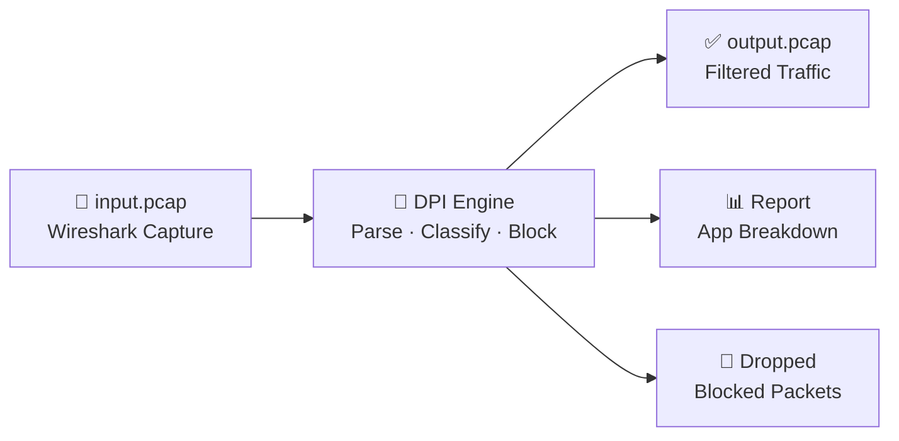
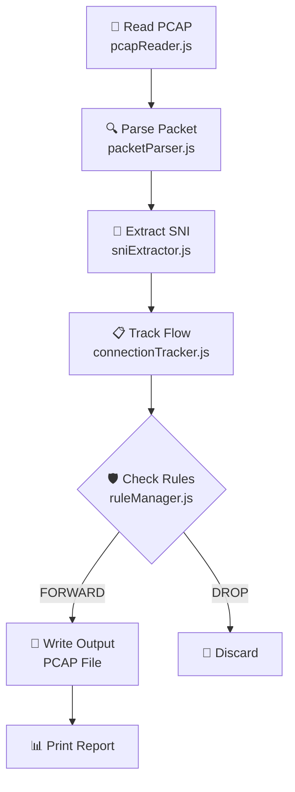
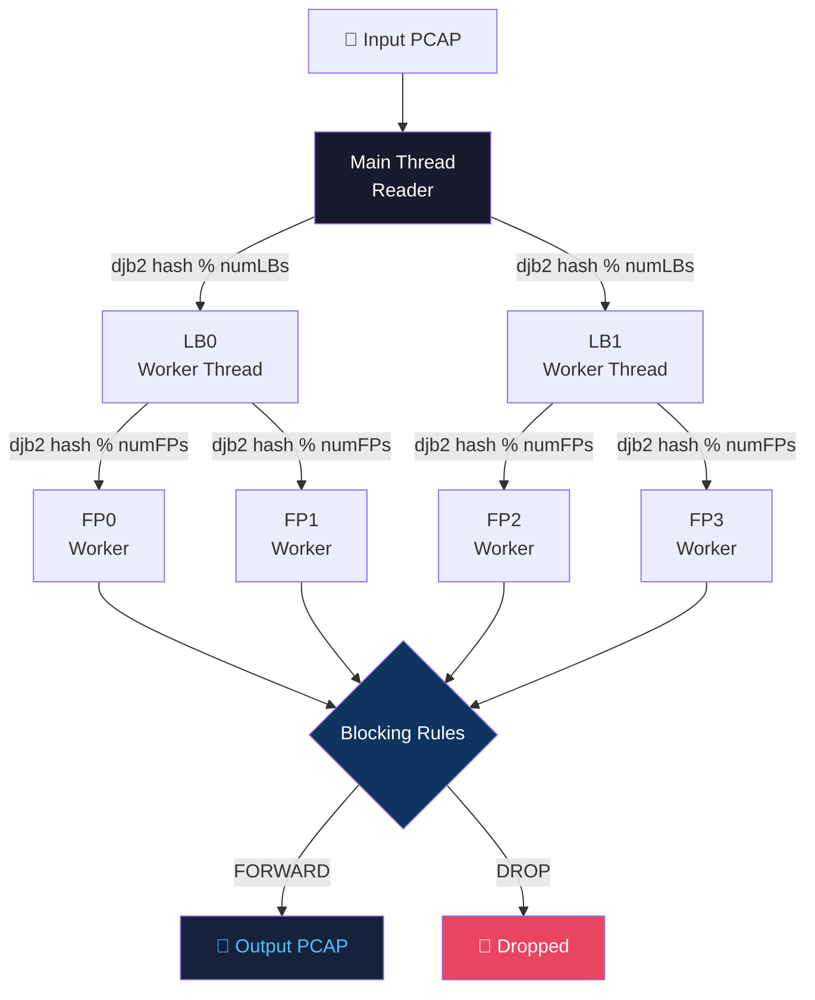
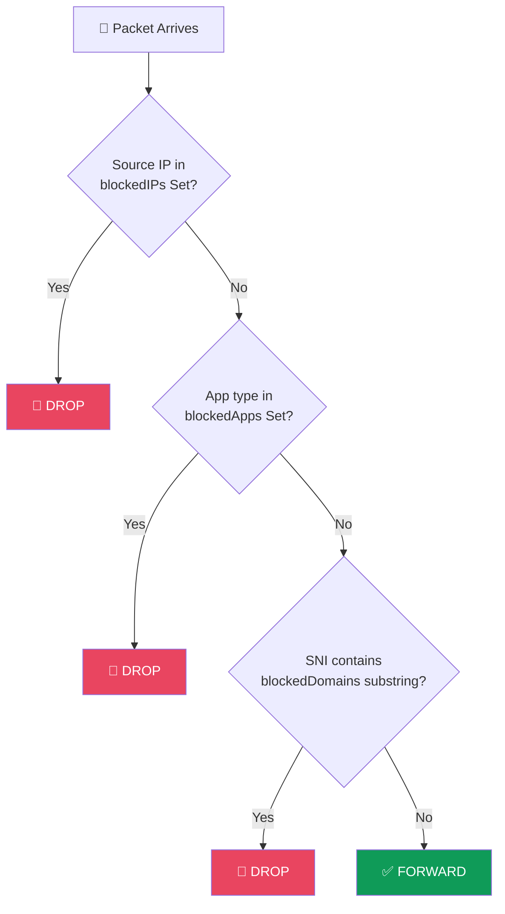

<div align="center">

<h1>🔬 Packet Analyzer — DPI Engine</h1>

<p><strong>Deep Packet Inspection System — Pure Node.js, Zero Dependencies</strong></p>


</div>

---

This document explains **everything** about this project — from basic networking concepts to the complete code architecture. After reading this, you should understand exactly how packets flow through the system without needing to read the code.

---

## 📑 Table of Contents

1.  [🔬 What is DPI?](#-what-is-dpi)
2.  [🌐 Networking Background](#-networking-background)
3.  [📋 Project Overview](#-project-overview)
4.  [🏗️ Architecture](#️-architecture)
5.  [🚶 The Journey of a Packet](#-the-journey-of-a-packet)
6.  [🧩 Deep Dive: Each Component](#-deep-dive-each-component)
7.  [📁 File Structure](#-file-structure)
8.  [⚙️ Installation](#️-installation)
9.  [🚀 Usage](#-usage)
10. [🔒 How SNI Extraction Works](#-how-sni-extraction-works)
11. [🛡️ How Blocking Works](#️-how-blocking-works)
12. [📱 Supported Applications](#-supported-applications)
13. [🧵 Multi-Threading Deep Dive](#-multi-threading-deep-dive)
14. [🖥️ Sample Output](#️-sample-output)
15. [🚫 Blocking Examples](#-blocking-examples)
16. [⚡ Performance](#-performance)
17. [🔧 Extending the Project](#-extending-the-project)
18. [🤝 Contributing](#-contributing)
19. [📄 License](#-license)

---

## 🔬 What is DPI?

**Deep Packet Inspection (DPI)** is a technology used to examine the contents of network packets as they pass through a checkpoint. Unlike simple firewalls that only look at packet headers (source/destination IP), DPI looks *inside* the packet payload.

### Real-World Uses:
- **ISPs**: Throttle or block certain applications (e.g., BitTorrent)
- **Enterprises**: Block social media on office networks
- **Parental Controls**: Block inappropriate websites
- **Security**: Detect malware or intrusion attempts

### What Our DPI Engine Does:



---

## 🌐 Networking Background

### The Network Stack (Layers)

When you visit a website, data travels through multiple "layers":

```text
┌─────────────────────────────────────────────────────────┐
│ Layer 7: Application    │ HTTP, TLS, DNS               │
├─────────────────────────────────────────────────────────┤
│ Layer 4: Transport      │ TCP (reliable), UDP (fast)   │
├─────────────────────────────────────────────────────────┤
│ Layer 3: Network        │ IP addresses (routing)       │
├─────────────────────────────────────────────────────────┤
│ Layer 2: Data Link      │ MAC addresses (local network)│
└─────────────────────────────────────────────────────────┘
```

### A Packet's Structure

Every network packet is like a **Russian nesting doll** — headers wrapped inside headers:

```text
┌──────────────────────────────────────────────────────────────────┐
│ Ethernet Header (14 bytes)                                       │
│ ┌──────────────────────────────────────────────────────────────┐ │
│ │ IPv4 Header (20 bytes)                                       │ │
│ │ ┌──────────────────────────────────────────────────────────┐ │ │
│ │ │ TCP Header (20 bytes)                                    │ │ │
│ │ │ ┌──────────────────────────────────────────────────────┐ │ │ │
│ │ │ │ Payload (Application Data)                           │ │ │ │
│ │ │ │ e.g., TLS Client Hello with SNI                      │ │ │ │
│ │ │ └──────────────────────────────────────────────────────┘ │ │ │
│ │ └──────────────────────────────────────────────────────────┘ │ │
│ └──────────────────────────────────────────────────────────────┘ │
└──────────────────────────────────────────────────────────────────┘
```

### The Five-Tuple

A **connection** (or "flow") is uniquely identified by 5 values:

| Field | Example | Purpose |
|-------|---------|---------|
| **Source IP** | `192.168.1.100` | Who is sending |
| **Destination IP** | `172.217.14.206` | Where it's going |
| **Source Port** | `54321` | Sender's application identifier |
| **Destination Port** | `443` | Service being accessed (443 = HTTPS) |
| **Protocol** | `TCP (6)` | TCP or UDP |

**Why is this important?**
- All packets with the same 5-tuple belong to the same connection
- If we block one packet of a connection, we should block all of them
- This is how we "track" conversations between computers

### What is SNI?

**Server Name Indication (SNI)** is part of the TLS/HTTPS handshake. When you visit `https://www.youtube.com`:

1. Your browser sends a "Client Hello" message
2. This message includes the domain name in **plaintext** (not encrypted yet!)
3. The server uses this to know which certificate to send

```text
TLS Client Hello:
├── Version: TLS 1.2
├── Random: [32 bytes]
├── Cipher Suites: [list]
└── Extensions:
    └── SNI Extension (type 0x0000):
        └── Server Name: "www.youtube.com"  ← We extract THIS!
```

**This is the key to DPI**: Even though HTTPS is encrypted, the domain name is visible in the first packet!

---

## 📋 Project Overview

### What This Project Does

```text
┌─────────────┐     ┌─────────────┐     ┌─────────────┐
│ Wireshark   │     │ DPI Engine  │     │ Output      │
│ Capture     │ ──► │             │ ──► │ PCAP        │
│ (input.pcap)│     │ - Parse     │     │ (filtered)  │
└─────────────┘     │ - Classify  │     └─────────────┘
                    │ - Block     │
                    │ - Report    │
                    └─────────────┘
```

### Two Versions

| Version | File | Use Case |
|---------|------|----------|
| **Single-threaded** | `src/index.js` | Learning, small captures |
| **Multi-threaded** | `src/indexMT.js` | Production, large captures |

---

## 🏗️ Architecture

### Diagram 1 — Single-threaded Mode (`index.js`)



### Diagram 2 — Multi-threaded Mode (`indexMT.js`)



---

## 🚶 The Journey of a Packet

### Single-Threaded Journey (`index.js`)

Let's trace a single packet through `src/index.js`:

#### Step 1: Read PCAP File

```javascript
const { openPcap, readGlobalHeader, readPackets } = require('./pcapReader');

const pcapBuf = openPcap(inputFile);
const ghdr = readGlobalHeader(pcapBuf);
```

**What happens:**
1. `openPcap()` reads the entire file into a Node.js `Buffer` via `fs.readFileSync()`
2. `readGlobalHeader()` reads the 24-byte global header, checks the magic number (`0xa1b2c3d4` native or `0xd4c3b2a1` swapped), and detects endianness
3. Returns version, snaplen, and link type

#### Step 2: Parse Each Packet

```javascript
for (const pkt of readPackets(pcapBuf)) {
    const parsed = parsePacket(pkt.data);
    if (parsed === null) continue;
    if (!parsed.hasTcp && !parsed.hasUdp) continue;
}
```

**What happens (in `packetParser.js`):**
- Bytes 0–13: Ethernet header → `srcMac`, `dstMac`, `etherType`
- Bytes 14+: IPv4 header → `srcIp`, `dstIp`, `protocol`, `ttl`
- TCP/UDP header → `srcPort`, `dstPort`, `tcpFlags`, `tcpSeq`, `tcpAck`
- Calculates `payloadOffset` and `payloadLength` for DPI

#### Step 3: Build Flow Key

```javascript
function flowKey(srcIp, srcPort, dstIp, dstPort, protocol) {
    return `${srcIp}:${srcPort}-${dstIp}:${dstPort}-${protocol}`;
}

const key = flowKey(parsed.srcIp, parsed.srcPort, parsed.dstIp, parsed.dstPort, parsed.protocol);
```

#### Step 4: Bidirectional Flow Lookup

```javascript
const flow = tracker.getOrCreateFlow(key);
```

Inside `connectionTracker.js`, `getOrCreateFlow()` checks:
1. Does the forward key exist? → return that flow
2. Does the reversed key (`dstIp:dstPort-srcIp:srcPort-protocol`) exist? → return that flow
3. Neither? → create a new flow

#### Step 5: Extract SNI (TLS Client Hello on port 443)

```javascript
if ((flow.appType === 'Unknown' || flow.appType === 'HTTPS') &&
    flow.sni === null && parsed.hasTcp && parsed.dstPort === 443) {

    if (parsed.payloadLength > 5) {
        const sni = extractSNI(pkt.data.subarray(parsed.payloadOffset));
        if (sni !== null) {
            flow.sni     = sni;
            flow.appType = appTypeToString(sniToAppType(sni));
        }
    }
}
```

#### Step 6: Extract HTTP Host (port 80)

```javascript
if ((flow.appType === 'Unknown' || flow.appType === 'HTTP') &&
    flow.sni === null && parsed.hasTcp && parsed.dstPort === 80) {

    if (parsed.payloadLength > 0) {
        const host = extractHTTPHost(pkt.data.subarray(parsed.payloadOffset));
        if (host !== null) {
            flow.sni     = host;
            flow.appType = appTypeToString(sniToAppType(host));
        }
    }
}
```

#### Step 7: Check Blocking Rules

```javascript
if (!flow.blocked) {
    flow.blocked = rules.isBlocked(parsed.srcIp, flow.appType, flow.sni || '');
}
```

`isBlocked()` checks in priority order:
1. Is `srcIp` in `blockedIPs` Set? → `true`
2. Is `appType` string (lowercased) in `blockedApps` Set? → `true`
3. Does `sni` contain any string from `blockedDomains` Set? → `true`

#### Step 8: Forward or Drop

```javascript
if (flow.blocked) {
    dropped++;
} else {
    forwarded++;
    const pktHdrBuf = Buffer.alloc(16);
    pktHdrBuf.writeUInt32LE(pkt.tsSec, 0);
    pktHdrBuf.writeUInt32LE(pkt.tsUsec, 4);
    pktHdrBuf.writeUInt32LE(pkt.data.length, 8);
    pktHdrBuf.writeUInt32LE(pkt.data.length, 12);
    outputChunks.push(pktHdrBuf);
    outputChunks.push(Buffer.from(pkt.data));
}
```

---

### Multi-Threaded Journey (`indexMT.js` + `dpiEngine.js`)

#### Step 1: Reader Hashes to LB

The main thread reads every packet, parses it, then hashes the five-tuple key to select a Load Balancer:

```javascript
const fiveTupleKey = `${parsed.srcIp}:${parsed.srcPort}-${parsed.dstIp}:${parsed.dstPort}-${parsed.protocol}`;

const lbIndex = djb2Hash(fiveTupleKey) % this._numLBs;

this._loadBalancers[lbIndex].distribute({
    data:         Array.from(pkt.data),
    parsed,
    fiveTupleKey,
    tsSec:        pkt.tsSec,
    tsUsec:       pkt.tsUsec,
});
```

#### Step 2: LB Hashes to FP

Each `LoadBalancer` hashes the same key again to pick a `FastPath` worker:

```javascript
distribute(packetObj) {
    const hash    = djb2Hash(packetObj.fiveTupleKey);
    const fpIndex = hash % this._numFastPaths;
    this._fastPaths[fpIndex].send(packetObj);
}
```

#### Step 3: FP Processes the Packet

Each `FastPath` is a `worker_threads` Worker running its own `ConnectionTracker` and `RuleManager`. It performs the same SNI extraction, HTTP host extraction, DNS classification, port-based fallback, and blocking that the single-threaded version does.

```javascript
// Inside the FastPath worker thread
const flow = tracker.getOrCreateFlow(key);

// SNI extraction for port 443
const sni = extractSNI(dataBuf.subarray(parsed.payloadOffset));

// Blocking check
const blocked = rules.isBlocked(parsed.srcIp, flow.appType, flow.sni || '');

if (blocked) {
    parentPort.postMessage({ action: 'drop', packet });
} else {
    parentPort.postMessage({ action: 'forward', packet });
}
```

#### Step 4: Output Writer Collects Results

Back in the main thread, `dpiEngine.js` listens for `forward`/`drop` messages from every FP via the LBs:

```javascript
lb.onResult((msg) => {
    if (msg.action === 'forward') {
        this._forwarded++;
        const dataBuf = Buffer.from(pkt.data);
        const pktHdrBuf = Buffer.alloc(16);
        pktHdrBuf.writeUInt32LE(pkt.tsSec, 0);
        pktHdrBuf.writeUInt32LE(pkt.tsUsec, 4);
        pktHdrBuf.writeUInt32LE(dataBuf.length, 8);
        pktHdrBuf.writeUInt32LE(dataBuf.length, 12);
        this._outputChunks.push(pktHdrBuf);
        this._outputChunks.push(dataBuf);
    } else {
        this._dropped++;
    }
});
```

Once all results are collected, the output is written:

```javascript
fs.writeFileSync(outputPcapPath, Buffer.concat(this._outputChunks));
```

---

## 🧩 Deep Dive: Each Component

<details>
<summary><b>📦 pcapReader.js — PCAP File Reading</b></summary>

Reads binary PCAP files captured by Wireshark, tcpdump, etc.

**`openPcap(filePath)`** — Reads the entire file into a Buffer via `fs.readFileSync()`.

**`readGlobalHeader(buf)`** — Reads the 24-byte global header:

```javascript
// Byte 0-3:   Magic number (0xa1b2c3d4 = native, 0xd4c3b2a1 = swapped)
const magicNumber = buf.readUInt32LE(0);

// Byte 4-5:   Version major
let versionMajor = buf.readUInt16LE(4);

// Byte 6-7:   Version minor
let versionMinor = buf.readUInt16LE(6);

// Byte 16-19: Snaplen (max bytes captured per packet)
let snaplen = buf.readUInt32LE(16);

// Byte 20-23: Network link type (1 = Ethernet)
let network = buf.readUInt32LE(20);
```

If the magic number is swapped (`0xd4c3b2a1`), fields are byte-swapped using `swap16()` and `swap32()` helpers.

**`readPackets(buf)`** — A generator that yields each packet. Starts at offset 24, reads 16-byte packet headers (`tsSec`, `tsUsec`, `inclLen`, `origLen`), then slices out `inclLen` bytes of packet data with `buf.subarray()` (zero-copy).

</details>

<details>
<summary><b>🔍 packetParser.js — Packet Parsing</b></summary>

Decodes raw Ethernet frames into structured objects.

**`parsePacket(data)`** returns an object with these fields:

```javascript
return {
    srcMac,          // "aa:bb:cc:dd:ee:ff"
    dstMac,          // "00:11:22:33:44:55"
    etherType,       // 0x0800 (IPv4)
    srcIp,           // "192.168.1.100" (from readUInt32BE at offset ipStart+12)
    dstIp,           // "142.250.185.206"
    protocol,        // 6 (TCP) or 17 (UDP)
    ttl,             // Time-to-live
    srcPort,         // readUInt16BE(transportStart)
    dstPort,         // readUInt16BE(transportStart + 2)
    tcpFlags,        // SYN=0x02, ACK=0x10, etc.
    tcpSeq,          // Sequence number
    tcpAck,          // Acknowledgment number
    hasTcp,          // true if protocol === 6
    hasUdp,          // true if protocol === 17
    payloadOffset,   // Where application data begins
    payloadLength,   // Bytes of application data
};
```

**IP conversion**: `readUInt32BE()` gives a 32-bit integer, converted to dotted-decimal:

```javascript
function ipToString(ip) {
    return `${(ip >>> 24) & 0xFF}.${(ip >>> 16) & 0xFF}.${(ip >>> 8) & 0xFF}.${ip & 0xFF}`;
}
```

**TCP data offset** is calculated dynamically to find the true payload start:

```javascript
const dataOffset   = (data[transportStart + 12] >> 4) & 0x0F;
const tcpHeaderLen = dataOffset * 4;
payloadOffset      = transportStart + tcpHeaderLen;
```

</details>

<details>
<summary><b>🔒 sniExtractor.js — TLS SNI & HTTP Host Extraction</b></summary>

**`extractSNI(payload)`** — Navigates the TLS Client Hello binary structure:

```javascript
function extractSNI(payload) {
    if (payload[0] !== 0x16) return null;   // Not a Handshake record
    if (payload[5] !== 0x01) return null;   // Not a Client Hello

    let offset = 43;                        // Skip to Session ID Length

    // Skip Session ID
    const sessionIdLen = payload[offset];
    offset += 1 + sessionIdLen;

    // Skip Cipher Suites
    const cipherSuitesLen = payload.readUInt16BE(offset);
    offset += 2 + cipherSuitesLen;

    // Skip Compression Methods
    const compressionMethodsLen = payload[offset];
    offset += 1 + compressionMethodsLen;

    // Read Extensions total length
    const extensionsLen = payload.readUInt16BE(offset);
    offset += 2;

    // Walk extensions looking for type 0x0000 (SNI)
    let extensionsEnd = offset + extensionsLen;
    while (offset + 4 <= extensionsEnd) {
        const extType = payload.readUInt16BE(offset);
        const extLen  = payload.readUInt16BE(offset + 2);
        offset += 4;

        if (extType === 0x0000) {         // SNI extension found!
            const sniNameLen = payload.readUInt16BE(offset + 3);
            return payload.toString('utf8', offset + 5, offset + 5 + sniNameLen);
        }
        offset += extLen;
    }
    return null;
}
```

**`extractHTTPHost(payload)`** — Checks if the payload starts with an HTTP method (`GET `, `POST`, `PUT `, `DELE`, `HEAD`), then searches for the `Host:` header using byte-level case-insensitive matching (`0x48` for `H` or `0x68` for `h`, etc.), strips the port if present, and returns the hostname.

</details>

<details>
<summary><b>📊 types.js — Application Classification</b></summary>

Defines the `AppType` enum as a frozen object:

```javascript
const AppType = Object.freeze({
    UNKNOWN: 0, HTTP: 1, HTTPS: 2, DNS: 3, TLS: 4, QUIC: 5,
    GOOGLE: 6, FACEBOOK: 7, YOUTUBE: 8, TWITTER: 9, INSTAGRAM: 10,
    NETFLIX: 11, AMAZON: 12, MICROSOFT: 13, APPLE: 14, WHATSAPP: 15,
    TELEGRAM: 16, TIKTOK: 17, SPOTIFY: 18, ZOOM: 19, DISCORD: 20,
    GITHUB: 21, CLOUDFLARE: 22, APP_COUNT: 23,
});
```

**`sniToAppType(sni)`** — Converts the SNI to lowercase and checks for substring matches in priority order. Example:

```javascript
const lower = sni.toLowerCase();
if (lower.includes('youtube') || lower.includes('ytimg') ||
    lower.includes('youtu.be') || lower.includes('yt3.ggpht')) {
    return AppType.YOUTUBE;
}
```

**`appTypeToString(type)`** — Maps enum values to display strings via a `Map` (e.g., `8 → "YouTube"`).

</details>

<details>
<summary><b>🛡️ ruleManager.js — Blocking Rules</b></summary>

Three rule types stored in `Set` collections:

```javascript
class RuleManager {
    constructor() {
        this.blockedIPs     = new Set();  // e.g. {"192.168.1.50"}
        this.blockedApps    = new Set();  // e.g. {"youtube"}  (lowercase)
        this.blockedDomains = new Set();  // e.g. {"tiktok"}   (lowercase)
    }
}
```

**`isBlocked(srcIp, appType, sni)`** checks in priority order:

```javascript
isBlocked(srcIp, appType, sni) {
    // 1. IP check (exact match)
    if (this.blockedIPs.has(srcIp)) return true;

    // 2. App check (case-insensitive)
    const appName = String(appType).toLowerCase();
    if (this.blockedApps.has(appName)) return true;

    // 3. Domain substring check (case-insensitive)
    if (sni) {
        const lowerSni = sni.toLowerCase();
        for (const dom of this.blockedDomains) {
            if (lowerSni.includes(dom)) return true;
        }
    }
    return false;
}
```

</details>

<details>
<summary><b>🌊 connectionTracker.js — Flow Tracking</b></summary>

Maintains a `Map<string, flow>` keyed by five-tuple strings.

**Five-tuple key format:** `srcIp:srcPort-dstIp:dstPort-protocol`

**Bidirectional lookup** — `getOrCreateFlow(key)` checks forward key, then reversed key:

```javascript
function reverseKey(key) {
    // "192.168.1.100:54321-142.250.185.206:443-6"
    //  becomes
    // "142.250.185.206:443-192.168.1.100:54321-6"
    const firstDash = key.indexOf('-');
    const lastDash  = key.lastIndexOf('-');
    const src      = key.substring(0, firstDash);
    const dst      = key.substring(firstDash + 1, lastDash);
    const protocol = key.substring(lastDash + 1);
    return `${dst}-${src}-${protocol}`;
}
```

**Flow object fields:**

```javascript
{
    sni:         null,       // "www.youtube.com" or null
    host:        null,       // HTTP Host header
    appType:     'Unknown',  // "YouTube", "HTTPS", "DNS", etc.
    blocked:     false,      // Set to true once a blocking rule matches
    packetCount: 0,          // Incremented for every packet in this flow
    byteCount:   0,          // Total bytes seen
    srcIp:       '',         // Populated on first packet
    dstIp:       '',
    srcPort:     0,
    dstPort:     0,
    protocol:    0,
}
```

</details>

<details>
<summary><b>📬 threadSafeQueue.js — Async Queue</b></summary>

Replaces mutex + condition_variable semantics with JavaScript Promises:

```javascript
class AsyncQueue {
    constructor(maxSize = 1000) {
        this._queue   = [];   // Internal FIFO buffer
        this._waiting = [];   // Pending pop() resolvers
    }

    push(item) {
        if (this._waiting.length > 0) {
            // Hand directly to a waiting consumer (like notify_one)
            const resolve = this._waiting.shift();
            resolve(item);
            return true;
        }
        if (this._queue.length >= this._maxSize) return false;
        this._queue.push(item);
        return true;
    }

    async pop() {
        if (this._queue.length > 0) {
            return this._queue.shift();
        }
        // Park a waiter — resolved by next push()
        return new Promise((resolve) => {
            this._waiting.push(resolve);
        });
    }
}
```

When `pop()` is called on an empty queue, a Promise is created and stored. The next `push()` resolves that Promise directly, mimicking how a condition variable wakes a blocked consumer.

</details>

<details>
<summary><b>⚡ fastPath.js — Worker Thread Processor</b></summary>

This file has a **dual-mode** design:

- **As a module** (when `require()`'d by the main thread): exports the `FastPath` class which spawns `worker_threads` Workers pointing back at this same file.
- **As a worker** (when executed inside a Worker): runs the packet-processing loop, receiving packets via `parentPort.on('message')`.

The worker side creates its own `ConnectionTracker` and `RuleManager`, hydrated from `workerData.ruleManagerConfig`. It performs SNI extraction, HTTP host extraction, DNS classification, port-based fallback, and blocking — then sends `{ action: 'forward' }` or `{ action: 'drop' }` back to the parent.

```javascript
// Worker spawning (parent side)
start() {
    this._worker = new Worker(__filename, {
        workerData: {
            id: this._id,
            ruleManagerConfig: this._config,
        },
    });
}

// Packet sending (parent side)
send(packetObj) {
    this._worker.postMessage(packetObj);
}
```

</details>

<details>
<summary><b>⚖️ loadBalancer.js — Hash-Based Distribution</b></summary>

Uses the **djb2** hash to consistently route packets to FastPath workers:

```javascript
function djb2Hash(str) {
    let hash = 5381;
    for (let i = 0; i < str.length; i++) {
        hash = ((hash << 5) + hash) + str.charCodeAt(i);  // hash * 33 + char
        hash = hash | 0;  // keep as 32-bit integer
    }
    return Math.abs(hash);
}
```

**Distribution**: `fpIndex = djb2Hash(fiveTupleKey) % numFastPaths`

Each `LoadBalancer` instance owns an array of `FastPath` workers and tracks per-FP dispatch counts.

</details>

<details>
<summary><b>🎛️ dpiEngine.js — Pipeline Orchestrator</b></summary>

`DPIEngine` ties everything together for multi-threaded mode:

1. Creates N `LoadBalancer` instances, each owning M `FastPath` workers
2. Opens the PCAP file, reads and parses each packet
3. Routes packets to LBs via `djb2Hash(fiveTupleKey) % numLBs`
4. LBs forward to FPs via `djb2Hash(fiveTupleKey) % numFastPathsPerLB`
5. Collects `forward`/`drop` results via callbacks
6. Writes forwarded packets to output PCAP file
7. Prints the processing report with LB dispatch statistics

The pipeline uses a `Promise` to wait until all results are collected before writing the output file and shutting down workers.

</details>

---

## 📁 File Structure

```text
Packet_analyzer/
├── src/
│   ├── types.js              # AppType enum, sniToAppType() domain-to-app mapping
│   ├── pcapReader.js         # Opens PCAP files, parses global header, yields packets
│   ├── packetParser.js       # Decodes Ethernet → IPv4 → TCP/UDP byte offsets
│   ├── sniExtractor.js       # Extracts SNI from TLS Client Hello & Host from HTTP
│   ├── index.js              # CLI entry point for single-threaded processing
│   ├── indexMT.js            # CLI entry point for multi-threaded worker_threads processing
│   ├── ruleManager.js        # Manages IP/App/Domain blocking rules using Sets
│   ├── connectionTracker.js  # Bidirectional five-tuple flow table with Map
│   ├── threadSafeQueue.js    # Promise-based async queue for inter-thread communication
│   ├── fastPath.js           # Dual-mode file: worker thread processor + class export
│   ├── loadBalancer.js       # djb2 hash-based packet distributor across FastPaths
│   ├── dpiEngine.js          # Pipeline orchestrator binding Reader → LBs → FPs → Output
│   ├── mainSimple.js         # Diagnostic: dumps packet five-tuples, no blocking/output
│   └── mainDpi.js            # Alternative MT entry with extended help and architecture diagram
├── generateTestPcap.js       # Builds test_dpi.pcap with 77 synthetic TLS/HTTP/DNS packets
├── package.json              # Project metadata, scripts: start, start:mt, generate-test
├── test_dpi.pcap             # Generated test capture file
├── output.pcap               # Output from a previous DPI run
└── README.md                 # This file
```

---

## ⚙️ Installation

```bash
git clone https://github.com/mukundjha-mj/dpi.git
cd dpi
node --version  # must be >= 16.0.0
```

**NO `npm install` needed. Zero external dependencies.** Only native Node.js modules are used: `fs`, `path`, `buffer`, `worker_threads`.

---

## 🚀 Usage

### Generate Test Data

```bash
node generateTestPcap.js
```

Creates `test_dpi.pcap` with 77 packets: 16 TLS connections with SNI, 2 HTTP connections, 4 DNS queries, and 5 packets from a blocked IP.

### Run Single-Threaded (`index.js`)

```bash
node src/index.js <input.pcap> <output.pcap> [options]
```

**Options:**
| Flag | Description |
|------|-------------|
| `--block-ip <ip>` | Block traffic from source IP |
| `--block-app <app>` | Block application (YouTube, Facebook, etc.) |
| `--block-domain <dom>` | Block domain (substring match) |

**Example:**
```bash
node src/index.js test_dpi.pcap filtered.pcap --block-app YouTube --block-ip 192.168.1.50
```

### Run Multi-Threaded (`indexMT.js`)

```bash
node src/indexMT.js <input.pcap> <output.pcap> [options]
```

**Options:**
| Flag | Description |
|------|-------------|
| `--block-ip <ip>` | Block traffic from source IP |
| `--block-app <app>` | Block application (YouTube, Facebook, etc.) |
| `--block-domain <dom>` | Block domain (substring match) |
| `--lbs <n>` | Number of Load Balancer instances (default: 2) |
| `--fps <n>` | FastPath workers per LB (default: 2) |
| `--help`, `-h` | Show help with architecture diagram |

**Example:**
```bash
node src/indexMT.js test_dpi.pcap filtered.pcap --block-app YouTube --block-ip 192.168.1.50 --lbs 4 --fps 4
```

### Run Diagnostic Dumper (`mainSimple.js`)

```bash
node src/mainSimple.js test_dpi.pcap
```

Prints each packet's five-tuple and any extracted SNI. No output file, no blocking.

### Run Alternative MT Entry (`mainDpi.js`)

```bash
node src/mainDpi.js test_dpi.pcap out.pcap --block-app YouTube
```

Same as `indexMT.js` but with extended `--help` text including an ASCII architecture diagram.

---

## 🔒 How SNI Extraction Works

### The TLS Handshake

```text
┌──────────┐                              ┌──────────┐
│  Browser │                              │  Server  │
└────┬─────┘                              └────┬─────┘
     │                                         │
     │ ──── Client Hello ─────────────────────►│
     │      (includes SNI: www.youtube.com)    │
     │                                         │
     │ ◄─── Server Hello ───────────────────── │
     │      (includes certificate)             │
     │                                         │
     │ ──── Key Exchange ─────────────────────►│
     │                                         │
     │ ◄═══ Encrypted Data ══════════════════► │
     │      (from here on, everything is       │
     │       encrypted - we can't see it)      │
```

**We can only extract SNI from the Client Hello!**

### TLS Client Hello Byte Layout

```text
Offset 0:      Content Type = 0x16 (Handshake)
Offset 1-2:    TLS Version = 0x0301
Offset 3-4:    Record Length
Offset 5:      Handshake Type = 0x01 (Client Hello)
Offset 6-8:    Handshake Length
Offset 9-10:   Client Version
Offset 11-42:  Random (32 bytes)
Offset 43:     Session ID Length (N)
Offset 44+N:   Session ID data
... Cipher Suites (2-byte length + data) ...
... Compression Methods (1-byte length + data) ...
... Extensions (2-byte total length) ...
    For each extension:
        Type (2 bytes) + Length (2 bytes) + Data
        When Type == 0x0000 → SNI Extension:
            SNI List Length (2 bytes)
            SNI Type (1 byte, 0x00 = hostname)
            SNI Name Length (2 bytes)
            SNI Name: "www.youtube.com" ← THE GOAL!
```

---

## 🛡️ How Blocking Works

### Rule Types

| Rule Type | Example | What it Blocks |
|-----------|---------|----------------|
| **IP** | `192.168.1.50` | All traffic from this source |
| **App** | `YouTube` | All YouTube connections |
| **Domain** | `tiktok` | Any SNI containing "tiktok" |

### The Blocking Flow



### Flow-Level Blocking

**Important:** We block at the *flow* level, not per packet.

```text
Connection to YouTube:
  Packet 1 (SYN)           → No SNI yet, FORWARD
  Packet 2 (SYN-ACK)       → No SNI yet, FORWARD
  Packet 3 (ACK)           → No SNI yet, FORWARD
  Packet 4 (Client Hello)  → SNI: www.youtube.com
                           → App: YOUTUBE (blocked!)
                           → Mark flow as BLOCKED
                           → DROP this packet
  Packet 5 (Data)          → Flow is BLOCKED → DROP
  Packet 6 (Data)          → Flow is BLOCKED → DROP
```

Once a flow is marked blocked in the `ConnectionTracker`, all subsequent packets for that flow are dropped immediately without re-checking rules.

---

## 📱 Supported Applications

Every pattern below is from the `sniToAppType()` function in `src/types.js`:

| Emoji | App | SNI Patterns | Example Domain |
|-------|-----|-------------|----------------|
| 🔍 | Google | `google`, `gstatic`, `googleapis`, `ggpht`, `gvt1` | www.google.com |
| 📺 | YouTube | `youtube`, `ytimg`, `youtu.be`, `yt3.ggpht` | www.youtube.com |
| 📘 | Facebook | `facebook`, `fbcdn`, `fb.com`, `fbsbx`, `meta.com` | www.facebook.com |
| 📸 | Instagram | `instagram`, `cdninstagram` | www.instagram.com |
| 💬 | WhatsApp | `whatsapp`, `wa.me` | web.whatsapp.com |
| 🍿 | Netflix | `netflix`, `nflxvideo`, `nflximg` | www.netflix.com |
| 🖥️ | Microsoft | `microsoft`, `msn.com`, `office`, `azure`, `live.com`, `outlook`, `bing` | www.microsoft.com |
| 🐦 | Twitter/X | `twitter`, `twimg`, `x.com`, `t.co` | twitter.com |
| 📦 | Amazon | `amazon`, `amazonaws`, `cloudfront`, `aws` | www.amazon.com |
| 🍎 | Apple | `apple`, `icloud`, `mzstatic`, `itunes` | www.apple.com |
| 📨 | Telegram | `telegram`, `t.me` | web.telegram.org |
| 🎵 | TikTok | `tiktok`, `tiktokcdn`, `musical.ly`, `bytedance` | www.tiktok.com |
| 🎧 | Spotify | `spotify`, `scdn.co` | open.spotify.com |
| 📹 | Zoom | `zoom` | zoom.us |
| 🎮 | Discord | `discord`, `discordapp` | discord.com |
| 💻 | GitHub | `github`, `githubusercontent` | github.com |
| ☁️ | Cloudflare | `cloudflare`, `cf-` | www.cloudflare.com |

---

## 🧵 Multi-Threading Deep Dive

Node.js `worker_threads` allows true parallel execution on multi-core CPUs. Each worker runs in its own V8 isolate with its own event loop.

### The djb2 Hash (from `loadBalancer.js`)

```javascript
function djb2Hash(str) {
    let hash = 5381;
    for (let i = 0; i < str.length; i++) {
        // hash = hash * 33 + charCode
        hash = ((hash << 5) + hash) + str.charCodeAt(i);
        hash = hash | 0; // keep as 32-bit integer
    }
    return Math.abs(hash);
}
```

### Why Consistent Hashing Matters

All packets with the same five-tuple must go to the same FastPath worker:

```text
Connection: 192.168.1.100:54321 → 142.250.185.206:443

Packet 1 (SYN):          hash → FP2
Packet 2 (SYN-ACK):      hash → FP2  (same FP!)
Packet 3 (Client Hello):  hash → FP2  (same FP!)
Packet 4 (Data):          hash → FP2  (same FP!)
```

Because the same FP handles all packets of a flow, it can correctly track connection state: extract SNI from the Client Hello, then apply that classification to all subsequent packets — without any cross-thread locking.

### Thread Architecture

```text
Main Thread:
  - Reads PCAP packets
  - Hashes five-tuple to select LB
  - Collects forward/drop results
  - Writes output PCAP

Worker Threads (per LB):
  - Receives packets from main thread
  - Hashes five-tuple to select FP

Worker Threads (per FP):
  - Owns private ConnectionTracker + RuleManager
  - Performs DPI (SNI extraction, classification)
  - Sends forward/drop decision back to main thread
```

---

## 🖥️ Sample Output

### Output 1: Single-Threaded, No Blocking Rules

```bash
node src/index.js test_dpi.pcap out.pcap
```

> **DPI ENGINE v1.0 (JS)**

#### Processing Report

| Metric | Value |
|--------|------:|
| Total Packets | 77 |
| Total Bytes | 5738 |
| TCP Packets | 73 |
| UDP Packets | 4 |
| Forwarded | 77 |
| Dropped | 0 |
| Active Flows | 27 |
| Blocked Flows | 0 |

#### Application Breakdown

| App | Packets | % |
|-----|--------:|----:|
| HTTPS | 55 | 71.4% |
| DNS | 4 | 5.2% |
| HTTP | 2 | 2.6% |
| Google | 1 | 1.3% |
| YouTube | 1 | 1.3% |
| Facebook | 1 | 1.3% |
| Instagram | 1 | 1.3% |
| Twitter/X | 1 | 1.3% |
| Amazon | 1 | 1.3% |
| Netflix | 1 | 1.3% |
| GitHub | 1 | 1.3% |
| Discord | 1 | 1.3% |
| Zoom | 1 | 1.3% |
| Telegram | 1 | 1.3% |
| TikTok | 1 | 1.3% |
| Spotify | 1 | 1.3% |
| Cloudflare | 1 | 1.3% |
| Microsoft | 1 | 1.3% |
| Apple | 1 | 1.3% |

#### Detected Domains

| SNI | App |
|-----|-----|
| www.google.com | Google |
| www.youtube.com | YouTube |
| www.facebook.com | Facebook |
| www.instagram.com | Instagram |
| twitter.com | Twitter/X |
| www.amazon.com | Amazon |
| www.netflix.com | Netflix |
| github.com | GitHub |
| discord.com | Discord |
| zoom.us | Zoom |
| web.telegram.org | Telegram |
| www.tiktok.com | TikTok |
| open.spotify.com | Spotify |
| www.cloudflare.com | Cloudflare |
| www.microsoft.com | Microsoft |
| www.apple.com | Apple |

### Output 2: Multi-Threaded with Blocking Rules

```bash
node src/indexMT.js test_dpi.pcap out.pcap --block-app YouTube --block-ip 192.168.1.50
```

> **DPI ENGINE v1.0 (JS) — Deep Packet Inspection System**

#### Configuration

| Setting | Value |
|---------|------:|
| Load Balancers | 2 |
| FPs per LB | 2 |
| Total FP threads | 4 |

#### Processing Report

| Metric | Value |
|--------|------:|
| Total Packets | 77 |
| Total Bytes | 5738 |
| TCP Packets | 73 |
| UDP Packets | 4 |
| Forwarded | 68 |
| Dropped | 9 |
| Drop Rate | 11.69% |

#### Load Balancer Statistics

| LB | Dispatched |
|----|----------:|
| LB0 | 38 |
| LB1 | 39 |

> **Note:** `index.js` does **not** print THREAD STATISTICS or LOAD BALANCER STATISTICS (it's single-threaded). `indexMT.js` prints LOAD BALANCER STATISTICS via `dpiEngine.js`.

---

## 🚫 Blocking Examples

### 1. Block an Application

```bash
node src/index.js test_dpi.pcap out.pcap --block-app YouTube
```
Blocks all flows classified as YouTube (any SNI containing `youtube`, `ytimg`, `youtu.be`, or `yt3.ggpht`).

### 2. Block a Source IP

```bash
node src/indexMT.js test_dpi.pcap out.pcap --block-ip 192.168.1.50
```
Drops all packets originating from `192.168.1.50` immediately, before any DPI analysis.

### 3. Block a Domain

```bash
node src/index.js test_dpi.pcap out.pcap --block-domain netflix.com
```
Blocks any flow whose SNI contains "netflix.com" as a substring.

### 4. Combined Blocking with Scaled Threads

```bash
node src/indexMT.js capture.pcap filtered.pcap \
    --block-app YouTube \
    --block-app TikTok \
    --block-ip 192.168.1.50 \
    --block-domain facebook.com \
    --lbs 4 --fps 4
```
Uses 4 LBs × 4 FPs = 16 worker threads, blocking YouTube, TikTok, a specific IP, and Facebook.

---

## ⚡ Performance

<table>
  <tr><th>Feature</th><th>Detail</th></tr>
  <tr><td>⚡ Zero npm dependencies</td><td>Only Node.js built-in modules: <code>fs</code>, <code>path</code>, <code>buffer</code>, <code>worker_threads</code></td></tr>
  <tr><td>🧵 Multi-threaded</td><td>Configurable LB and FP worker threads via <code>--lbs</code> and <code>--fps</code></td></tr>
  <tr><td>🔁 Consistent hashing</td><td>djb2 ensures same flow always routes to same FastPath worker</td></tr>
  <tr><td>💾 Zero-copy parsing</td><td><code>Buffer.subarray()</code> slices without copying bytes</td></tr>
  <tr><td>↔️ Bidirectional flows</td><td>Reverse key lookup ensures both directions of a TCP connection share one flow</td></tr>
</table>

---

## 🔧 Extending the Project

### 1. Add More App Signatures

Add new patterns to the `sniToAppType()` function in `src/types.js`:

```javascript
// Add Twitch support
if (lower.includes('twitch') || lower.includes('ttvnw')) {
    return AppType.TWITCH;
}
```

Don't forget to add the new `TWITCH` entry to the `AppType` enum and the `_appTypeStringMap`.

### 2. Add Bandwidth Throttling

Instead of dropping packets, delay them:

```javascript
if (shouldThrottle(flow)) {
    await new Promise(resolve => setTimeout(resolve, 10));
}
parentPort.postMessage({ action: 'forward', packet });
```

### 3. Add Live Statistics Dashboard

Create a separate thread printing stats every second:

```javascript
setInterval(() => {
    const stats = tracker.getStats();
    console.log(`Flows: ${stats.totalFlows} | Blocked: ${stats.blockedFlows}`);
}, 1000);
```

### 4. Add QUIC/HTTP3 Support

QUIC uses UDP on port 443. The Initial packet contains the SNI in a different format. You would add UDP port 443 handling in `fastPath.js` and a new `extractQUICsni()` function.

### 5. Add Persistent Rules from File

Load rules from a JSON config file:

```javascript
const config = JSON.parse(fs.readFileSync('rules.json', 'utf8'));
config.blockedIPs.forEach(ip => rules.addBlockedIP(ip));
config.blockedApps.forEach(app => rules.addBlockedApp(app));
config.blockedDomains.forEach(dom => rules.addBlockedDomain(dom));
```

---

## 🤝 Contributing

1. Fork the Project
2. Create your Feature Branch (`git checkout -b feature/AmazingFeature`)
3. Commit your Changes (`git commit -m 'Add some AmazingFeature'`)
4. Push to the Branch (`git push origin feature/AmazingFeature`)
5. Open a Pull Request

---

## 📄 License

**MIT**

---

<div align="center">
  <p>Built with ❤️ in Node.js</p>
</div>
